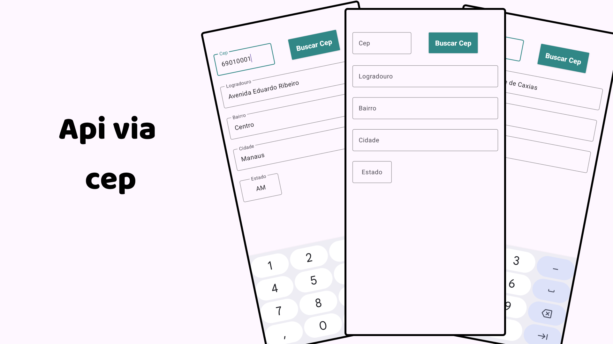
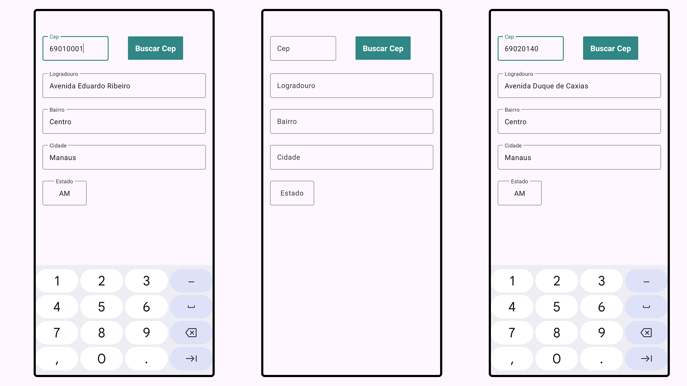

# 🔎 Projeto Busca CEP com Retrofit  

  

Este projeto é um aplicativo Android desenvolvido em **Kotlin**, que consome a API pública do [ViaCEP](https://viacep.com.br/) para buscar informações de endereços a partir de um CEP informado pelo usuário.  

A aplicação foi construída com **Retrofit** para realizar a comunicação com a API, e utiliza o **View Binding** para manipulação de elementos da interface de forma mais segura e eficiente.  

---

## 🚀 Funcionalidades  
- Busca de informações do endereço a partir do CEP.  
- Validação de entrada (campo vazio).  
- Preenchimento automático dos campos:  
  - Logradouro  
  - Bairro  
  - Cidade  
  - Estado  
- Exibição de mensagens de erro para casos de **CEP inválido** ou **falha de conexão**.  

---

## 🛠️ Tecnologias Utilizadas  
- **Kotlin**  
- **Retrofit** (requisições HTTP)  
- **Gson Converter** (serialização JSON)  
- **View Binding**  
- **API ViaCEP**  

---

## 📱 Telas do Projeto  

  

---

👉 Esse projeto me ajudou a aprofundar meus conhecimentos em **consumo de APIs no Android**, **boas práticas de arquitetura** e no uso do **Retrofit** para lidar com dados externos de forma simples e eficaz.  
